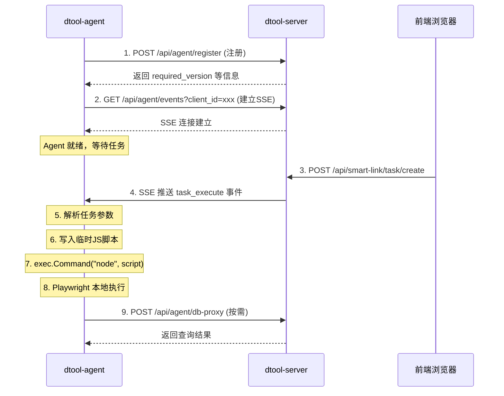

## 产品概述

重写 dtool-agent 客户端程序，使其通过 SSE 长连接接收主服务下发的 Playwright 任务，在本地执行浏览器自动化操作。删除旧版 HTTP 轮询/结果上报等废弃逻辑。

## 核心功能

- **SSE 任务接收**: Agent 连接主服务注册后建立 SSE 长连接，由服务端主动推送任务，替代旧的 HTTP 轮询
- **启动时环境检测与安装**: 自动检测本地 Node.js 是否安装，自动安装/更新 Playwright 浏览器核心（chromium）
- **本地 Playwright 执行**: 收到任务后生成 Node.js 脚本并调用本地 Playwright 执行，浏览器在用户本机打开（headful 模式）
- **数据库代理**: Agent 执行过程中如需读写服务端数据库配置，通过服务端开放的数据库代理 API 处理
- **清理废弃逻辑**: 删除 PollTask 轮询、reportTask 结果上报、旧版心跳等不再需要的代码

## 技术栈

- **Agent**: Go 标准库 + `gitee.com/Sxiaobai/gs/v2/gstool`（保持现有依赖不变，不引入 internal 包）
- **Playwright 执行**: Node.js + npm playwright 包，Agent 通过 `os/exec` 调用
- **SSE 客户端**: Go 标准库 `net/http` + 手写 SSE 流解析（协议简单，无需第三方库）
- **服务端**: 复用现有 `gsgin.SseRoute` 体系新增 Agent SSE 端点

## 实现方案

### 架构设计



### Agent 端重写方案 (`cmd/dtool-agent/main.go`)

完全重写为以下模块：

1. **启动流程**: `main()` → 读环境变量 → `checkNodeJS()` → `ensurePlaywright()` → `register()` → `connectSSE()` → 事件循环
2. **Node.js 检测**: 通过 `exec.LookPath("node")` + `exec.Command("node", "--version")` 检测，找不到则提示并退出
3. **Playwright 安装**: 在 `~/.dtool/agent/` 工作目录下执行 `npm install playwright`，然后 `npx playwright install chromium`
4. **SSE 客户端**: GET 请求 `/api/agent/events`，逐行解析 `data:` 前缀的事件流，按 `sse_distribute_id` 分发到处理器
5. **任务执行**: 收到 `task_execute` 事件后，将任务参数写入临时 JS 文件，`exec.Command("node", script)` 执行
6. **DB 代理客户端**: 封装 `dbProxyQuery(table, where)` / `dbProxyUpdate(table, where, data)` 方法

### Playwright Runner 脚本 (嵌入 Go 二进制)

使用 Go 1.16+ `embed` 包嵌入 JS runner 脚本。脚本功能：

- 接收 JSON 配置参数（URL、步骤列表、变量替换等）
- 启动 Chromium 浏览器（headful 模式，用户可见）
- 按步骤执行：open → click → input → wait → text_content → screenshot → close
- 支持基础定位器：css、text、role、xpath
- 执行完成后浏览器保持打开（用户可继续交互）

### 服务端变更

#### 新增 Agent SSE 端点

- 路由: `GET /api/agent/events` (免鉴权)
- Agent 连接后注册到全局 SSE 管理器（以 `agent_{client_id}` 为 key）
- 支持推送事件类型：`task_execute`、`ping`

#### 修改任务创建流程

- `SmartLinkTaskCreate` 创建任务后，查找已连接的 Agent SSE 连接
- 构造完整执行载荷（SmartLink 配置 + 步骤 + 变量）通过 SSE 推送
- 任务状态从 `pending` 直接变为 `pushed`（已推送）

#### 新增数据库代理 API

- 路由: `POST /api/agent/db-proxy` (免鉴权)
- 支持操作：`query`（查询表）、`query_one`（查询单条）
- 限制可访问的表白名单，防止越权

#### 清理旧 API

- 删除 `GET /api/agent/task/pull`（由 SSE 推送替代）
- 删除 `POST /api/agent/task/report`（不再需要结果上报）
- 保留 `POST /api/agent/register`（注册逻辑不变）
- 心跳改为 SSE 层面的 keep-alive，删除独立的 heartbeat API

### 数据库代理安全设计

- 表白名单: `tbl_smart_link`、`tbl_smart_link_process`、`tbl_smart_link_process_item`、`tbl_global`、`tbl_account`、`tbl_group`
- 只允许 SELECT 查询，不允许 INSERT/UPDATE/DELETE（通过操作类型限制）
- 后续如需写入，可按表单独开放

## 实现要点

### 性能考量

- SSE 长连接断开后自动重连（指数退避，最大 30s）
- Playwright 安装只在首次或版本变更时执行，通过锁文件判断
- 任务执行使用独立 goroutine，不阻塞 SSE 接收

### 错误处理

- Node.js 未安装: 打印安装指引并优雅退出
- Playwright 安装失败: 打印错误但不退出（标记状态为 preparing_runtime）
- SSE 断线: 自动重连，重连成功后重新注册
- 任务执行失败: 日志输出到控制台，不上报服务端

### 向后兼容

- 服务端注册 API 保持不变
- Agent 下载构建机制（ldflags 注入 serverURL）保持不变
- 前端 SSE 推送的客户端状态逻辑保持不变

## 目录结构

```
cmd/dtool-agent/
├── main.go              # [MODIFY] 完全重写: SSE客户端 + Playwright管理 + 任务执行
├── runner.js            # [NEW] 嵌入的 Playwright 执行脚本模板
└── sse_client.go        # [NEW] SSE 客户端解析器 (从 main.go 拆分)

internal/app/dtool/
├── controller/
│   ├── smart_link_local_client.go           # [MODIFY] 新增 AgentSSE、AgentDbProxy; 删除 AgentTaskPull/AgentTaskReport; 修改 SmartLinkTaskCreate 推送逻辑
│   └── smart_link_local_client_download.go  # [不修改] 下载构建逻辑保持不变
├── router.go                                # [MODIFY] 替换 task/pull+task/report 为 agent/events+agent/db-proxy
├── middleware/
│   └── safe_auth.go                         # [MODIFY] 更新白名单: 删除旧的, 新增 agent/events + agent/db-proxy
├── define/
│   └── sse.go                               # [MODIFY] 新增 SseAgentTaskExecute 常量
└── database/2026/04/
    └── 20260412_smart_link_local_client.sql  # [不修改] 表结构不变
```

## 关键代码结构

### Agent SSE 事件协议

```
// 服务端推送给 Agent 的 SSE 数据格式 (复用现有 SseData)
type AgentTaskEvent struct {
    SseDistributeId string `json:"sse_distribute_id"` // "task_execute"
    Data            any    `json:"data"`
    Type            string `json:"type"`
}

// task_execute 的 Data 载荷
type TaskExecutePayload struct {
    TaskID       string `json:"task_id"`
    SmartLinkID  int    `json:"smart_link_id"`
    Label        string `json:"label"`
    URL          string `json:"url"`
    OpenType     int    `json:"open_type"`
    Steps        []any  `json:"steps"`        // ProcessStep 列表
    Variables    map[string]string `json:"variables"` // 变量替换
    AccountList  []map[string]string `json:"account_list"` // 账号列表
}
```

### 数据库代理请求格式

```
// Agent 发送的 DB 代理请求
type DbProxyRequest struct {
    ClientID string         `json:"client_id"`
    Action   string         `json:"action"`    // "query" | "query_one"
    Table    string         `json:"table"`     // 白名单内的表名
    Where    map[string]any `json:"where"`     // 查询条件
    Fields   string         `json:"fields"`    // 查询字段, 默认 "*"
}
```

## SubAgent

- **code-explorer**: 用于深入查看服务端 SSE 注册机制、Playwright 步骤执行细节，确保 Agent 端实现与服务端协议一致