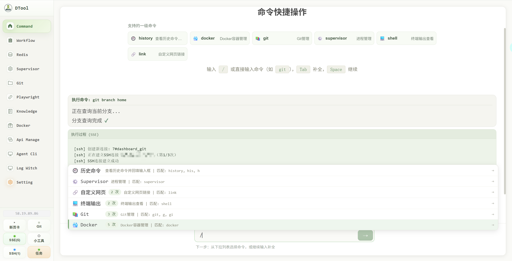
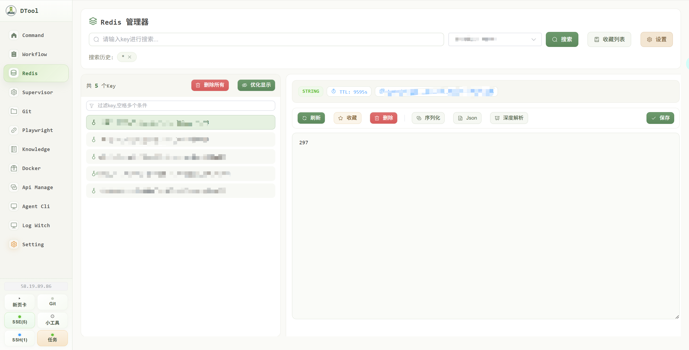
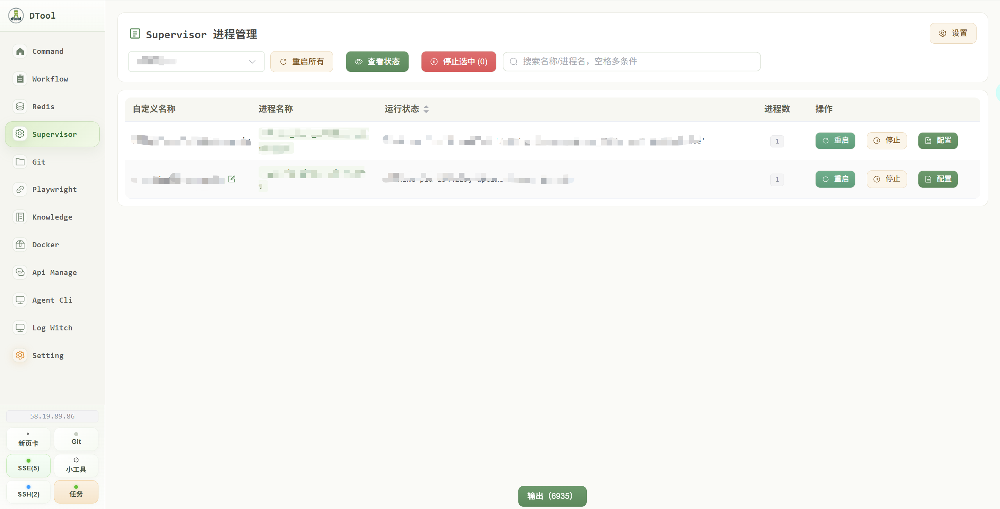
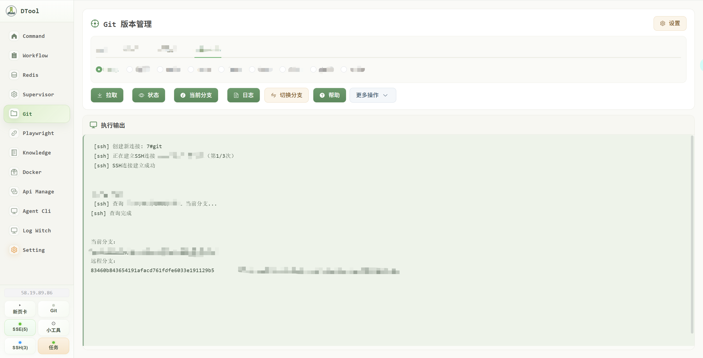
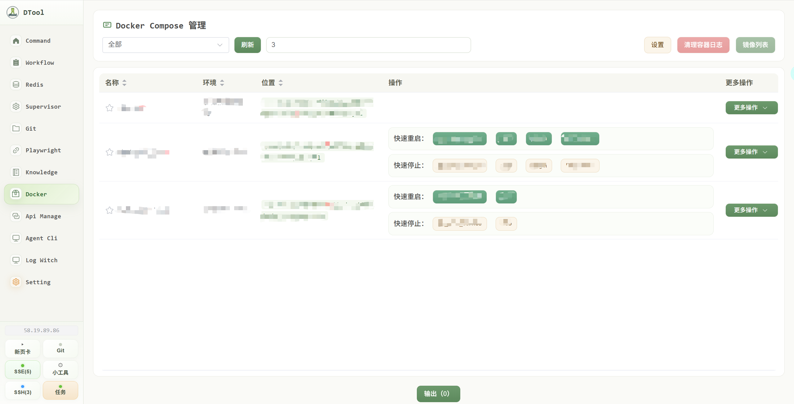
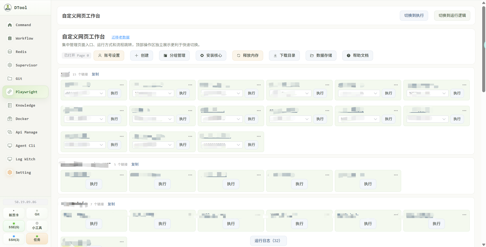
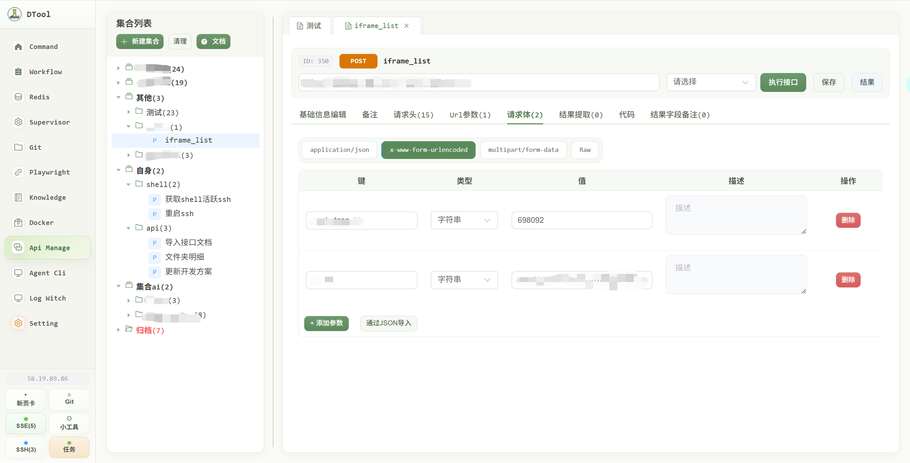
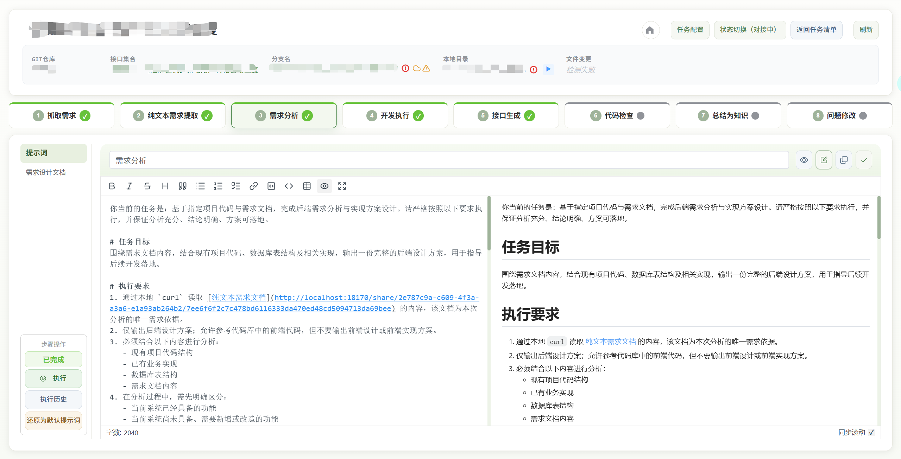
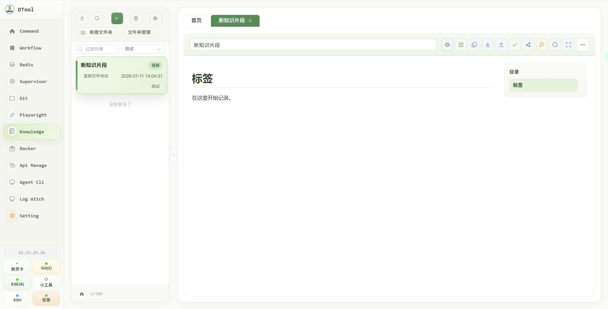
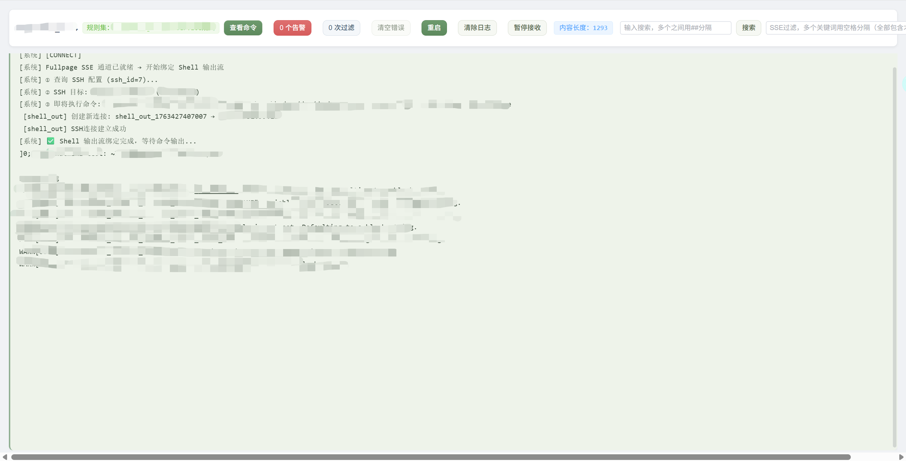

# ai-dtool

`ai-dtool` 是一个面向个人开发者与小团队的本地开发工具集，集成了 Redis、Git、Docker、Supervisor、接口管理、任务流程（基于需求制定一套Agent执行流程）、知识片段（md文档管理）等能力，把日常高频的开发操作集中到一个 Web 界面里完成，提升大量工作效率。

## 系统定位

`ai-dtool` 围绕日常开发执行过程设计，重点解决下面几类问题：

- 不同的测试环境地址过多后混乱问题
- 需求任务多了分支不记得，环境不记得问题
- Git、Redis、Docker、Supervisor 等操作需要登录不同的终端，多了以后混乱问题
- 接口、需求、Git分支等分散在不同工具里，无法统一管理
- 需求分析、开发执行、测试修复、代码检查缺少统一流程
- 日常知识、日志结果、自动化脚本难以复用和沉淀

## 核心功能

### 1. 首页工作台

- 提供统一入口，集中访问常用模块
- 支持快捷命令操作，减少页面切换和重复输入
- 展示异步任务状态，方便查看正在执行、待处理和失败任务
- 适合作为整个系统的日常操作首页

### 2. Redis 缓存管理

- 管理多个 Redis 连接配置
- 支持按环境切换缓存实例
- 进行常见的缓存查询与键值查看
- 适合排查缓存命中、配置值、会话信息等场景

### 3. Supervisor 进程管理

- 查看进程运行状态
- 执行重启、停止等常见操作
- 查看进程配置内容
- 适合管理常驻服务、消费者进程和后台任务

### 4. Git 仓库与分支管理

- 管理多个代码仓库配置
- 查看当前分支、远程分支和提交日志
- 执行拉取、切换分支、创建分支等常用操作
- 支持按分组管理仓库，方便在多项目场景中快速定位

### 5. Docker 与 Compose 管理

- 查看 Docker Compose 项目列表
- 执行服务启动、停止、重启、查看状态等操作
- 查看服务配置与环境文件
- 查看镜像列表和镜像下容器信息
- 支持维护默认服务，适合常用服务组合的快速操作

### 6. 自定义网页自动化

- 配置业务常用网页入口
- 支持基于流程节点执行网页自动化动作
- 支持账号、标签、页面定位、等待、跳转、提取内容等能力
- 适合做登录流程、页面采集、固定步骤执行和浏览器自动化辅助操作

### 7. 接口开发与调试

- 管理接口集合、文件夹和接口条目
- 支持接口编辑、调试执行和结果记录
- 支持环境变量管理，方便不同环境下复用接口配置
- 支持生成独立接口文档页，方便共享和查阅
- 适合作为轻量级的本地接口管理与联调工具

### 8. 工作流程与任务协同

- 围绕需求处理提供任务化管理入口
- 支持将任务与 Git、接口集合、本地目录、Docker、数据库、自定义网页等开发资源关联
- 支持分支名生成、需求资料整理、流程化执行
- 提供从需求获取、分析、开发、接口生成、测试修复到代码检查的统一工作流视图
- 适合把复杂开发任务拆成可追踪、可复用、可持续推进的步骤
- 集成codex cli和claude cli，执行任务，也可以复制提示词到任意ide执行

### 9. 知识片段与内容沉淀

- 维护可持续积累的知识片段
- 支持编辑、检索、历史查看和分享
- 可用于沉淀需求背景、排查结论、操作步骤和公共提示词
- 让日常经验不再只停留在聊天记录或临时文档里
- 提供 Markdown 内容编辑与整理能力
- 适合保存临时文档、调试说明、流程说明和结构化笔记
- 可以作为需求梳理、自动化结果整理和知识沉淀的中间载体

### 10. 日志输出与监控查看

- 统一查看命令执行输出
- 支持按规则处理和筛选日志内容
- 适合集中查看脚本执行结果、服务输出和排查日志
- 减少在多个终端窗口之间来回切换

## 说明

本项目个人开发项目，持续约4年多，已经作为工作中必用工具，能够极大的提升工作效率。今年加入了最新的需求工作流，可以自动抓取tapd需求内容，自动进行开发流程，内置的支持codex cli和claude cli的执行。
有问题可以联系 q：948040237
